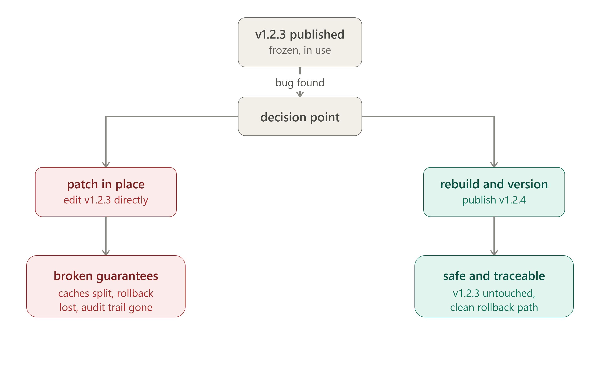

# The Immutability Principle for Artifacts

Once you publish an artifact — a built package, container image, compiled binary, or release bundle — it should be treated as **frozen**. If something needs to change, you build a new artifact with a new identifier rather than editing the existing one in place.

## Why this matters

**1. Reproducibility breaks otherwise**
If `myapp:1.2.3` can be silently overwritten, then "deploy version 1.2.3" stops meaning anything fixed. Two people pulling the same tag on different days could get different code. Debugging, rollback, and audits all depend on a version pointing to exactly one unchanging thing.

Reproducibility — same version = same code, every time, for everyone

**2. Caching and distribution assume immutability**
CDNs, package registries, and container layers cache aggressively based on the assumption that content at a given address never changes. Mutating a published artifact means some consumers get the old cached copy and some get the new one — a silent, hard-to-diagnose split.

Safe caching — systems reuse downloaded copies assuming they never change

**3. Traceability for debugging and security**
When an incident happens, you want to know: what exact code was running? If artifacts can be patched in place, "what was deployed" becomes a moving target. Immutable artifacts let you say with certainty "this hash/tag was built from this commit, with this dependency set."

Trustworthy debugging — "what exact code was running" always has one answer

**4. Rollback requires a stable "before"**
Rolling back only works cleanly if the previous artifact still exists unchanged. Patch-in-place erases your safety net — there's no known-good state to fall back to.

Reliable rollback — the old version must still exist, untouched, to fall back to

**5. Supply-chain trust**
Signing, checksums, and provenance attestations (e.g., SBOMs, cosign signatures) are only meaningful if the artifact they describe can't change after the fact. Mutable artifacts make signatures lie.

Valid signatures — checksums/signatures only mean something if content can't change after signing

## Rebuild vs. patch, concretely

| | Patch-in-place | Rebuild-and-replace |
|---|---|---|
| Version meaning | Ambiguous over time | Fixed forever |
| Rollback | Unreliable | Trivial (redeploy old artifact) |
| Caching | Unsafe | Safe |
| Audit trail | Broken | Intact |
| Fix delivery | Edit `v1.2.3` directly | Ship `v1.2.4` |

**The wrong vs right move**

- ❌ Wrong: overwrite the same version number / tag / filename with new content
- ✅ Right: build a new version number / tag / filename; mark the old one deprecated if it was bad — don't delete or edit it

The "cost" of this discipline is that even a one-line fix requires a full new build and a version bump — but that cost buys you the ability to trust what "version X" means at any point in the future.

## The escape hatch, done properly

When you truly need to invalidate a bad artifact (e.g., it contains a security vulnerability or leaked secret), the correct move is **retraction/deprecation**, not silent mutation — mark it as yanked (as npm, PyPI, and crates.io do) while leaving the historical record intact, and publish a new, corrected version.

If you tell me what kind of artifact you're writing this note about — container images, npm packages, ML model artifacts, static site builds, etc. — I can tighten this up with concrete examples and tooling references (digests vs. tags, content-addressed storage, etc.).