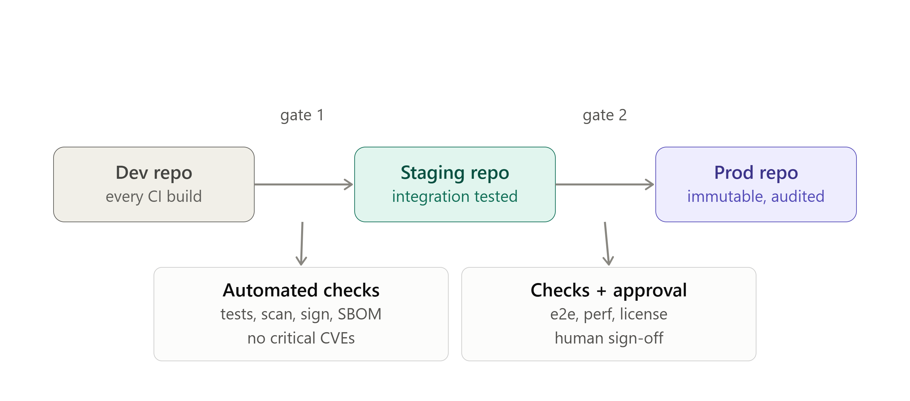

Here's how promotion pipelines for artifacts typically work, and what good gating criteria look like at each stage.

## The basic flow

**Dev repo** → **Staging repo** → **Prod repo**

Each repo represents a trust tier. An artifact (a container image, package, model binary, Helm chart, etc.) is built once and then *promoted* — copied or referenced — from one tier to the next, rather than being rebuilt at each stage. Rebuilding at each stage risks non-reproducibility (different artifact bits ending up in prod than what was tested in staging).

- **Dev repo**: where every CI build lands, including from feature branches. High volume, short retention, low trust. Anyone can pull from it internally, but nothing here is expected to be stable.
- **Staging repo**: only artifacts that passed initial automated checks get promoted here. Used for integration testing, QA, pre-prod validation.
- **Prod repo**: the final, immutable, audited source of truth for what's actually deployed. Tightly access-controlled — usually only the CI/CD system (not humans) can write to it.

## Typical gating criteria between stages

**Dev → Staging**
- Build succeeds and unit tests pass
- Static analysis / linting passes
- SBOM (software bill of materials) generated
- Vulnerability scan with no critical/high CVEs (or an approved exception)
- Artifact is signed (e.g., cosign/Sigstore) and checksums recorded
- Semantic version or immutable tag assigned (no `latest` promotion)

**Staging → Prod**
- Integration/end-to-end tests pass in a staging environment
- Performance/load tests meet thresholds
- Security scan re-verified (staging environment may surface issues dev didn't)
- Manual approval or change-ticket sign-off (common in regulated environments)
- License compliance check
- No unresolved P0/P1 bugs tied to this artifact version
- Rollback plan / previous prod artifact still available

## A few design principles worth calling out

1. **Promote references, not rebuilds.** The exact same digest (e.g., a container's SHA256) that passed staging should be what lands in prod — not a re-tagged rebuild.
2. **Immutability increases as you go right.** Dev tags can be overwritten; prod tags generally should never be.
3. **Automate the gate checks, but decide where humans sit.** Fully automated promotion is common up through staging; prod promotion often keeps a human approval step, especially for regulated industries.
4. **Retention policy differs per tier.** Dev artifacts can be garbage-collected aggressively (days); prod artifacts are often kept indefinitely for audit/rollback.

Here's the pipeline as a diagram, followed by a full gating criteria table.Trust and immutability increase left to right — dev is mutable and high-volume, prod is locked down and audited.

## Full gating criteria table

| Category | Dev → Staging | Staging → Prod |
|---|---|---|
| **Testing** | Unit tests pass | Integration/e2e tests pass in staging env |
| **Security** | No critical/high CVEs; artifact signed | Security scan re-verified; no new findings |
| **Provenance** | SBOM generated; checksums recorded | Same digest promoted, not rebuilt |
| **Quality gates** | Lint/static analysis passes | Performance/load thresholds met |
| **Versioning** | Immutable tag assigned (no `latest`) | Tag frozen; no further mutation allowed |
| **Compliance** | — | License compliance check |
| **Approval** | Fully automated | Manual sign-off / change ticket (common in regulated orgs) |
| **Rollback readiness** | — | Previous prod artifact retained |
| **Bug status** | — | No open P0/P1 tied to this version |

A couple of practical notes if you're implementing this:

- **Write access narrows at each tier.** Dev repo: any CI job. Staging: only the pipeline, gated by criteria above. Prod: only the release pipeline, usually with a short-lived credential per promotion — no human ever `docker push`es directly to prod.
- **Retention mirrors trust.** Dev artifacts can expire in days; prod artifacts are kept indefinitely (or per your compliance window) since they're your audit trail.
- **Gate failures should be visible, not silent.** A failed gate should block promotion and surface *why* (which check failed) rather than just leaving the artifact stuck in the lower tier with no explanation.

